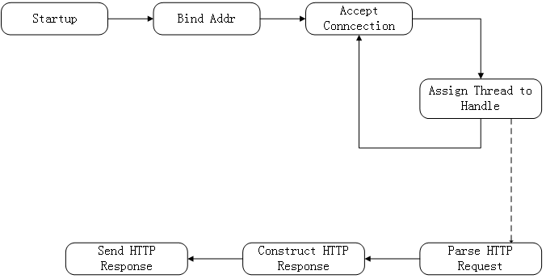

# muQhttpd

muQhttpd - A simple `one thread per connection` http server.

<!-- TOC depthFrom:2 -->

- [1. Supported Features](#1-supported-features)
- [2. Build](#2-build)
- [3. Run](#3-run)
- [4. How it works](#4-how-it-works)
    - [4.1. Startup & Configuration](#41-startup--configuration)
    - [4.2. Bind & Listen Address](#42-bind--listen-address)
    - [4.3. Accept & Handle Client Connection](#43-accept--handle-client-connection)
    - [4.4. Shutdown](#44-shutdown)

<!-- /TOC -->

## 1. Supported Features

- [x] handle HTTP request line & HTTP resonse line, HTTP headers are ommited(including Conetent-Length and Conetent-Type)
- [x] HTTP GET to distribute static web resources(.html, .js, .css, .jpg etc)
- [ ] HTTP GET or POST to execute cgi in `/cgi-bin` path
- [ ] others

## 2. Build

muQhttpd is supposed to be build in a Linux environment, because it contains several linux-specific features.

Run the command below with a POSIX-compatible shell.

```
mkdir cmake-build && cd cmake-build && cmake .. && make
```

## 3. Run

muQhttpd is supposed to run in a Linux environment, because it contains several linux-specific features.

muQhttpd arranges its files in three seperate directories(default `./www, ./conf ./log`). You can ovveride each default directory by specifying it in the configuration file `logdir/muqhttpd.conf`, then use `--confdir|-c` option to tell muQhttpd.

`muqhttpd [--confdir|-c conf-dir]`

If one of the directories not exists, muQhttpd will report a error on `stderr` and exit.

## 4. How it works



### 4.1. Startup & Configuration

At startup, muQhttpd will read the configuration file `muqhttpd.conf` from `--confdir`(default is `.` if not specified). 

Configuration file specifies:

1. IPv4 address to bind and listen.
1. Maximum thread number allowed.
1. Log level
1. WWW directory, which is used as the webroot
1. Log directory

### 4.2. Bind & Listen Address

### 4.3. Accept & Handle Client Connection

### 4.4. Shutdown

